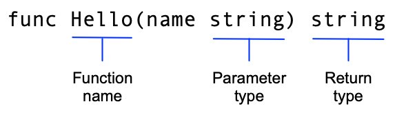

## [Tutorial: Create a Go module](https://go.dev/doc/tutorial/create-module)

- Go code is grouped into **packages**, and packages are grouped into **modules**
- Your module specifies dependencies needed to run your code, including the **Go version** and **the set of other modules it requires**

### greetings.go
- In Go, a function whose **name starts with a capital letter** can be called by a function **not in the same package**

- The `:=` operator is a shortcut for **declaring** and **initializing** a variable in one line

#### `Sprintf` function
```go
var message string
message = fmt.Sprintf("Hi, %v. Welcome!", name)
```
- The first argument is a **format string**, and Sprintf substitutes the name parameter's value for the `%v` format verb

#### Return and handle an error
- `nil` (meaning no error)


#### Return a random greeting
- A slice is like an array, except that its size changes dynamically as you add and remove items
- Go executes `init` functions automatically at program startup, after global variables have been initialized